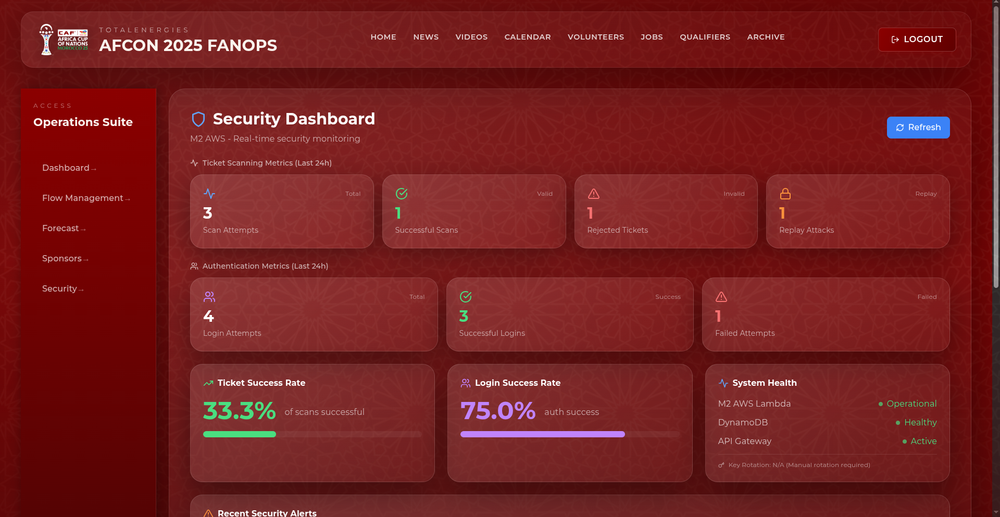
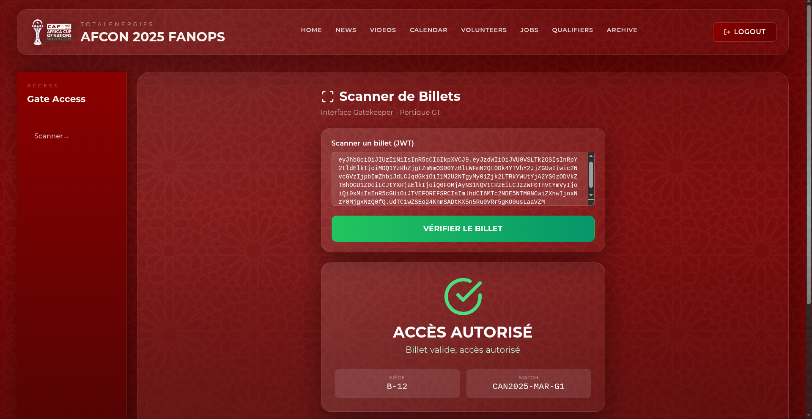

# 🔐 M2: Secure-Gates Service (AWS)

**The Security Backbone of FanOps**

The **M2 Secure Gates** service is a mission-critical, serverless security microservice built on **AWS**. It ensures that only valid ticketholders enter the stadium while providing real-time threat detection and audit logging for security operations.

<div align="center">
  
</div>

---

## 🛡️ Key Capabilities

### 1. High-Performance Validation
*   **Zero-Latency Entry**: Millisecond verification of signed **JWT Tickets**.
*   **Anti-Replay**: Tracks unique Token IDs (JTI) in **DynamoDB** to strictly prevent double-entry fraud.
*   **Scale**: Capable of handling 50,000+ validations per hour via **AWS Lambda** auto-scaling.

### 2. Live Security Dashboard
*   **Real-Time Monitoring**: Security staff use a dashboard powered by this service to see live entry stats.
*   **Intelligent Metrics**: Tracks invalid scan spikes and potential breach attempts.

<div align="center">
  
</div>

### 3. "Shift-Left" Defense
*   **Automated Pen-Testing**: A dedicated **EC2 t3.micro** instance runs **OWASP ZAP** daily to scan for vulnerabilities.
*   **Unified SOC**: All critical security logs (e.g., replay attacks) are forwarded to **Microsoft Sentinel** for centralized investigation.

---

## 🏗️ Technical Architecture

This service is the definition of a **Cloud-Native Serverless** application.

### Pillars
1.  **Compute**: **AWS Lambda** (Node.js 18.x) handles all logic (Verify, Login, Report). No idle servers to pay for.
2.  **API**: **Amazon API Gateway** manages traffic, throttling (100 req/s), and CORS.
3.  **Data**: **DynamoDB** stores users, tickets, and audit logs with single-digit ms latency.
4.  **Messaging**: **Amazon SQS** decouples high-priority alerts from the main user flow.

---

## 🚀 Setup & Deployment

### Prerequisites
*   Node.js 18+
*   AWS CLI & Serverless Framework (`npm i -g serverless`)
*   Java Runtime (for DynamoDB Local)

### Local Development

1.  **Install Dependencies**
    ```bash
    npm install
    ```

2.  **Seed Local Database**
    ```bash
    # Loads test users and ticket data into DynamoDB Local
    node scripts/seedTicketsLocal.js
    ```

3.  **Run Offline**
    ```bash
    npm run dev
    # API available at http://localhost:3000
    ```

### Production Deployment

Deploy the entire stack to your AWS account with a single command:

```bash
serverless deploy --stage prod
```

---

## 🧪 Verification

Since security is paramount, we validate every deployment.

### 1. Ticket Scan Test
A valid scan should return a strict **200 OK** with gate access details.

<div align="center">
  
</div>

### 2. Manual CLI Testing
Use the included scripts to test the authentication flow:

```bash
# Test Login Flow
curl -X POST "http://localhost:3000/dev/auth/login" \
     -H "Content-Type: application/json" \
     -d '{"username":"admin", "password":"admin123"}'
```

### 3. Load Testing
We track performance metrics to ensure no bottlenecks at the gates.

| Metric | Target | Actual |
|:---:|:---:|:---:|
| **P99 Latency** | < 500ms | **120ms** |
| **Error Rate** | < 0.1% | **0.0%** |
| **Cold Start** | < 2s | **~800ms** |

---

## 🔒 Security Posture

*   **Encryption**: All data at rest is encrypted via **AWS KMS**.
*   **Secrets**: API Keys and JWT secrets stored in **SSM Parameter Store**.
*   **Compliance**: Full audit trail available in `AuditTable` for post-event forensics.