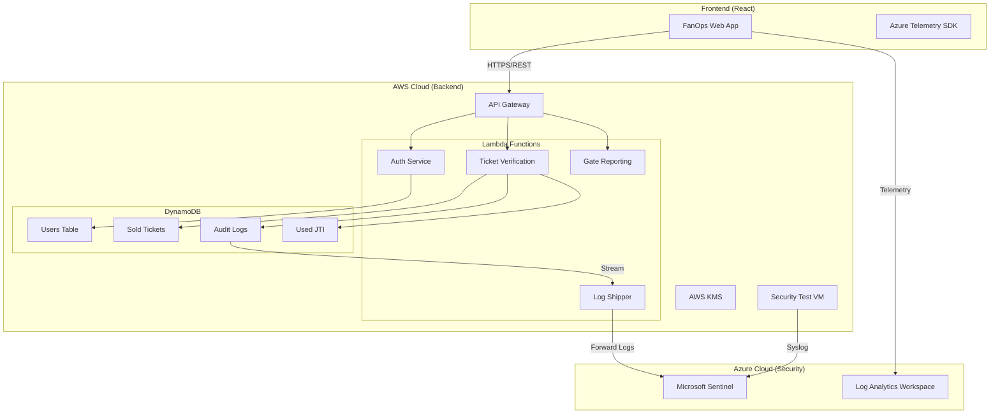

# 📘 FanOps M2 Security Service - Comprehensive Report

## 1. Executive Summary

**M2 (Secure Gates)** is the core security microservice for the **CAN 2025 FanOps** platform. It creates a secure, scalable, and serverless environment for managing stadium access.

The system is designed to handle high-concurrency ticket scanning, prevent fraud (anti-replay), and provide real-time security monitoring via a **Multi-Cloud Architecture** (AWS for compute/storage, Azure for SIEM/Threat Detection).

---

## 2. 🏗️ High-Level Architecture

The architecture follows a **Serverless Event-Driven** pattern, ensuring zero idle costs and infinite scalability during match days.

---

## 3. ☁️ Cloud Service Models

We utilize the full spectrum of cloud service models to optimize for cost, management, and control.

### ⚡ FaaS (Function as a Service)
*   **AWS Lambda**: The core compute engine.
    *   **Usage**: Runs business logic (Ticket Verification, Login) only when triggered.
    *   **Benefit**: Zero idle cost. We only pay when a fan scans a ticket (milliseconds).
    *   **Scale**: Automatically handles 1 to 10,000 concurrent scans without configuration.

### 🛠️ PaaS (Platform as a Service)
*   **AWS API Gateway**: Manages the HTTP endpoints, rate limiting, and SSL termination.
*   **AWS DynamoDB**: A fully managed NoSQL database for high-speed storage.
*   **AWS SQS**: Managed message queues for decoupling services.
*   **Azure Sentinel**: Cloud-native SIEM for security analytics.
*   **Azure Log Analytics**: Managed data lake for storing logs.

### 💻 IaaS (Infrastructure as a Service)
*   **AWS EC2 (t3.micro)**: A virtual machine used for **Security Testing**.
    *   **Usage**: Hosts penetration testing tools and scripts to simulate attacks against the API.
    *   **Control**: We have full OS-level access (Ubuntu Linux) to install custom security tools.
    *   **Integration**: Connected to Azure Sentinel via the Azure Monitor Agent to audit OS-level logs (Syslog/Auth).

---

## 4. 🔄 Information Flow

### A. Authentication Flow (User Login)
1.  **User** submits credentials on the Frontend.
2.  **Frontend** sends `POST /auth/login` to AWS API Gateway.
3.  **Lambda (Login)**:
    *   Retrieves user hash from **DynamoDB (Users)**.
    *   Validates password (bcrypt).
    *   Generates a **JWT** signed with a secret from **AWS KMS**.
4.  **Frontend** receives the JWT and stores it.
5.  **Telemetry**: Frontend logs `Login_Success` to **Azure Sentinel**.

### B. Ticket Verification Flow (Stadium Access)
1.  **Gatekeeper** scans a QR Code (JWT).
2.  **Frontend** sends `POST /security/verifyTicket` to AWS.
3.  **Lambda (Verify)**:
    *   **Signature Check**: Verifies JWT signature using KMS key.
    *   **Ownership Check**: Queries **DynamoDB (Sold Tickets)** to ensure ticket exists.
    *   **Anti-Replay**: Checks **DynamoDB (Used JTI)**. If `jti` exists, rejects as "Replay Attack".
    *   **Commit**: Writes `jti` to Used Table and logs event to **DynamoDB (Audit)**.
4.  **Response**: Returns `Access Granted` or `Access Denied`.

### C. Security Monitoring Flow (The "Watchtower")
1.  **Data Ingestion**:
    *   **Frontend**: Sends performance metrics and user actions (Login, PageView) to **Azure Log Analytics**.
    *   **Backend**: AWS Lambda logs (CloudWatch) are forwarded to **Azure Sentinel** via a specialized "Shipper" Lambda.
2.  **Threat Detection**:
    *   **Sentinel** runs KQL queries every 5 minutes.
    *   *Example Rule*: "If > 5 failed logins in 1 minute, trigger Alert."
3.  **Response**:
    *   Security Analysts view incidents in **Microsoft Defender Portal**.

---

## 5. 🧩 Services & Technologies Breakdown

### ☁️ AWS (The Engine)
| Service | Type | Role | Why it was chosen |
| :--- | :--- | :--- | :--- |
| **Lambda** | **FaaS** | Compute | Zero server management, auto-scaling for match spikes. |
| **API Gateway** | **PaaS** | API Management | Built-in throttling, DDoS protection, and SSL. |
| **DynamoDB** | **PaaS** | Database | Single-digit millisecond latency for fast scanning. |
| **KMS** | **PaaS** | Security | FIPS 140-2 validated encryption for JWT secrets. |
| **CloudWatch** | **PaaS** | Logging | Native logging for all AWS resources. |
| **EC2** | **IaaS** | Testing | Full control for running security audit tools. |

### 🛡️ Azure (The Shield)
| Service | Type | Role | Why it was chosen |
| :--- | :--- | :--- | :--- |
| **Sentinel** | **PaaS** | SIEM | AI-driven threat detection and correlation. |
| **Log Analytics** | **PaaS** | Data Lake | Central storage for logs from all clouds. |
| **App Insights** | **PaaS** | APM | Deep visibility into Frontend performance and errors. |

### 💻 Frontend (The Interface)
| Technology | Role |
| :--- | :--- |
| **React + Vite** | Fast, modern UI framework. |
| **Tailwind CSS** | Responsive styling. |
| **Axios** | HTTP Client with Interceptors for telemetry. |

---

## 6. 🔗 Service Connections

### Frontend ↔ AWS
*   **Protocol**: HTTPS (REST)
*   **Security**: JWT (Bearer Token)
*   **Endpoints**:
    *   `https://.../dev/auth/login`
    *   `https://.../dev/security/verifyTicket`

### Frontend ↔ Azure
*   **Protocol**: HTTPS (Telemetry)
*   **Key**: Instrumentation Key (Connection String)
*   **Data**: Asynchronous batches of events (non-blocking).

### AWS ↔ Azure
*   **Mechanism**: Lambda Log Shipper
*   **Flow**: CloudWatch Logs → Lambda → Azure HTTP Data Collector API.
*   **Latency**: Near real-time (< 1 min).

---

## 7. 🚀 Conclusion

The **FanOps M2** module is a robust, production-ready security system. By combining the **scalability of AWS Serverless** with the **advanced threat intelligence of Microsoft Azure**, it provides a secure and observable platform for managing the CAN 2025 event.
