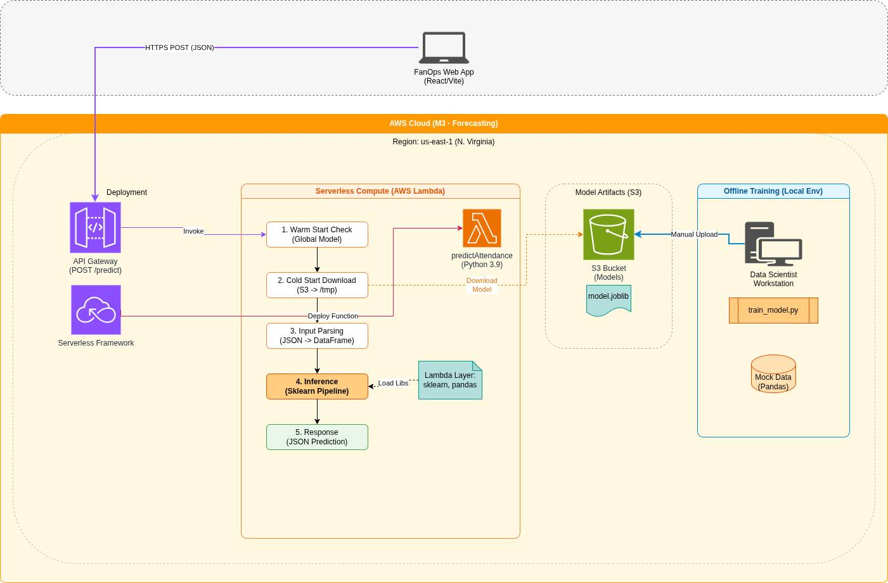
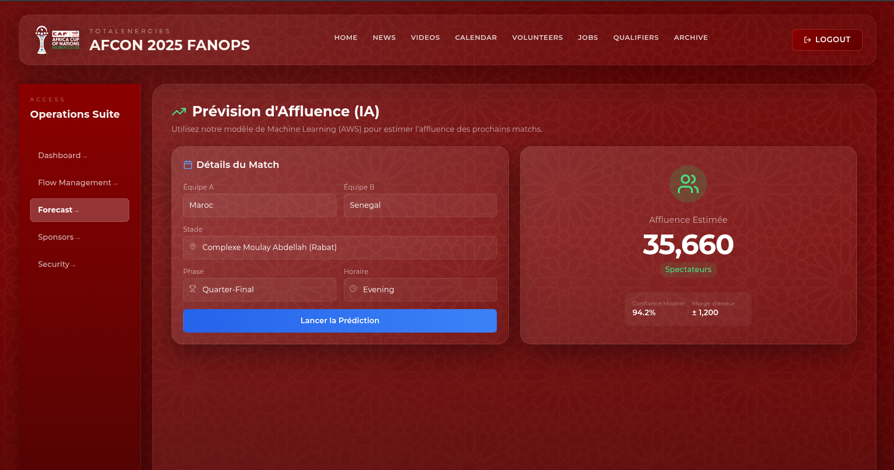

# 🔮 M3: Forecast Service (AWS)

**Predicting the Future of Fan Attendance**

The **M3 Forecast Service** is a predictive analytics engine powered by **Machine Learning** on **AWS**. It allows stadium operators to anticipate crowd levels days in advance, enabling proactive resource allocation (security staff, catering, gates).

<div align="center">
  
</div>

---

## 🎯 Key Capabilities

### 1. Smart Forecasting
*   **Context-Aware AI**: The model doesn't just guess; it analyzes factors like:
    *   **Team Popularity**: (e.g., Morocco vs. Brazil draws more than Team A vs. Team B).
    *   **Time of Day**: Night matches have different attendance patterns.
    *   **Tournament Stage**: Finals > Group Stages.
    *   **Stadium**: Capacity and location constraints.

### 2. Decision Support
The service outputs actionable intelligence, not just numbers.

*   **Prediction**: "Expected Attendance: 45,120"
*   **Confidence Interval**: "Range: 42,000 - 48,000"
*   **Fill Rate**: "67% Capacity"

<div align="center">
  
</div>

---

## 🏗️ Technical Architecture

This service is optimized for **Cold-Start Performance** and scale.

### Components
1.  **Compute**: **AWS Lambda** (Python 3.9) executes the inference.
2.  **Model Store**: **Amazon S3** holds the trained `model.joblib` artifacts. The Lambda downloads and caches this model primarily in `/tmp` to minimize S3 costs and latency on subsequent runs.
3.  **Dependencies**: **Lambda Layers** are used to package heavy data science libraries (`scikit-learn`, `pandas`, `numpy`) separately from the business logic, keeping the deployment package lightweight.

### Workflow
1.  **Training (Offline)**: `train_model.py` runs on a developer machine or CI pipeline to generate a new model artifact.
2.  **Upload**: The artifact is pushed to the S3 Bucket `m3-forecast-models-can2025`.
3.  **Inference (Online)**:
    *   Frontend sends a JSON payload to **API Gateway**.
    *   Lambda wakes up, checks for a cached model.
    *   If cold, downloads model from S3.
    *   Runs Random Forest regression.
    *   Returns JSON response.

---

## 🚀 Setup & Usage

### Prerequisites
*   Python 3.9+
*   AWS CLI & Serverless Framework

### 1. Train the Model
Generate a fresh model artifact based on the latest dataset.

```bash
python train_model.py
# Output: model.joblib (Saved locally)
```

### 2. Deploy Dependencies
Install the heavy libraries into a compatible Lambda Layer.

```bash
# Install binary-compatible Linux wheels
python -m pip install \
   --platform manylinux2014_x86_64 \
   --target layer/python \
   --implementation cp \
   --python-version 3.9 \
   --only-binary=:all: \
   --upgrade pandas scikit-learn scipy

# Optimize size
python clean_layer.py
```

### 3. Deploy Service
```bash
serverless deploy
```

---

## 📡 API Reference

### `POST /predict`

Predict attendance for a specific match scenario.

**Request:**
```json
{
  "team_a": "Morocco",
  "team_b": "France",
  "stadium": "Grand Stade de Marrakech",
  "time": "Night",
  "stage": "Semi-Final"
}
```

**Response:**
```json
{
  "predicted_attendance": 45120,
  "confidence_interval": [42000, 48000],
  "stadium_capacity": 67000,
  "fill_rate": 0.67
}
```
