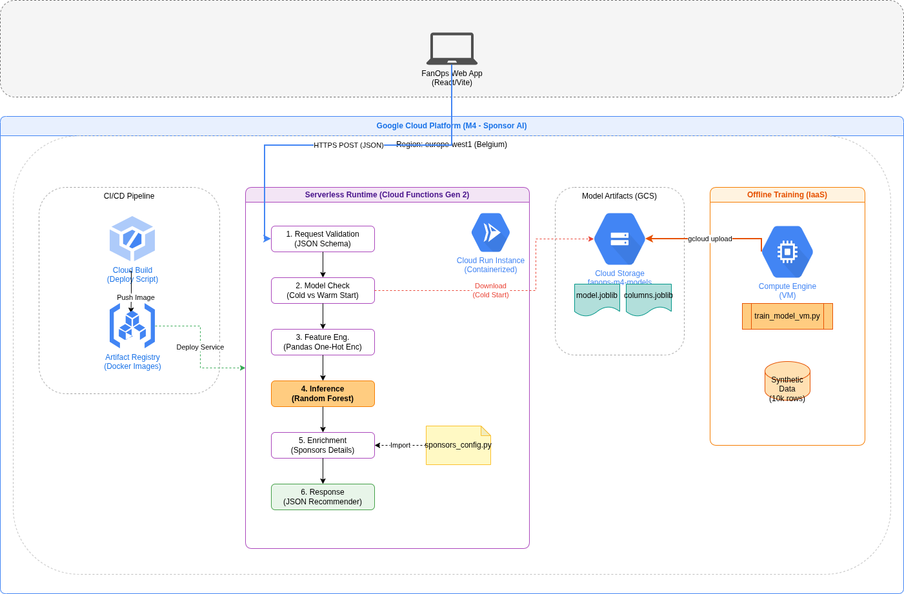
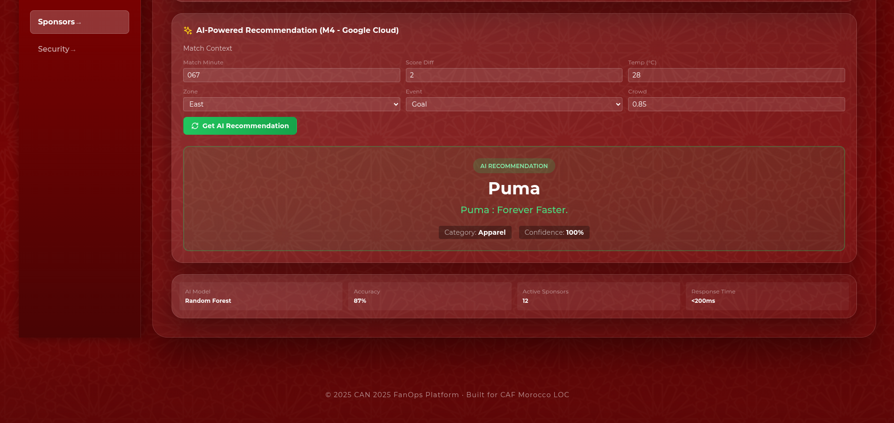

# 📢 M4: Sponsor AI (Google Cloud)

**Delivering the Right Message at the Right Moment**

The **M4 Sponsor AI** is a real-time recommendation engine running on **Google Cloud Platform (GCP)**. It leverages **scikit-learn** decision trees to push personalized, context-aware sponsor advertisements to fans' mobile devices during the match.

<div align="center">
  
</div>

---

## 🎯 Key Capabilities

### 1. Context-Aware Marketing
Instead of generic ads, the AI analyzes real-time signals to choose the perfect sponsor:
*   **High Temp (>30°C)** → Recommends **Sidi Ali / Coca-Cola** (Refreshments).
*   **Goal Scored** → Recommends **Puma / Adidas** (Celebration).
*   **Halftime** → Recommends **Inwi / Orange** (Data/Connect).
*   **VIP Zone** → Recommends **Royal Air Maroc / OCP** (Premium services).

### 2. Live Recommendation Engine
The frontend queries this microservice to get a JSON payload containing the banner image URL, promo text, and tracking ID.

<div align="center">
  
</div>

---

## 🏗️ Technical Architecture

This service uses **Google Cloud Functions Gen 2** for high scalability and concurrency.

### Stack
1.  **Compute**: **Cloud Functions (Python 3.10)** handles the logic. It's stateless and scales to zero when not in use.
2.  **Storage**:
    *   **Cloud Storage**: Stores the trained ML model (`model.joblib`) and sponsor asset images (logos, banners).
3.  **ML Core**: A **Random Forest Classifier** trained on 10,000+ historical scenarios to predict the highest conversion probability for each sponsor.

### Data Flow
1.  **Frontend Request**: Sends `{"temperature": 28, "match_minute": 45, "event": "Goal", "zone": "East"}`.
2.  **Inference**:
    *   Function loads model from `/tmp` (warm start) or GCS (cold start).
    *   Predicts the best sponsor category.
    *   Selects specific creative asset.
3.  **Response**: Returns `{"sponsor": "Puma", "message": "GOAL! Get 20% off jerseys.", "image": "https://..."}`.

---

## 🚀 Setup & Deployment

### Prerequisites
*   Google Cloud SDK (`gcloud`)
*   Python 3.10 & pip

### 1. Train Model
Generate the decision tree artifacts locally.

```bash
python train_model.py
# Output: model.joblib, model_columns.joblib
```

### 2. Upload Artifacts
Push the model to a GCS bucket so the function can access it.

```bash
gcloud storage cp model.joblib gs://fanops-m4-models/
gcloud storage cp model_columns.joblib gs://fanops-m4-models/
```

### 3. Deploy Function
Deploy directly to GCP using the `deploy.sh` script or `gcloud` command.

```bash
./deploy.sh
# OR manually:
gcloud functions deploy m4-sponsor-ai \
  --gen2 --region=europe-west1 --runtime=python310 --memory=512MB \
  --trigger-http --allow-unauthenticated
```

---

## 🧪 Testing

### Local Unit Test
Verify the logic without deploying.

```bash
python verify_local.py
```

### Live Endpoint
Once deployed, test with `curl`:

```bash
curl -X POST https://europe-west1-can2025-fanops.cloudfunctions.net/m4-sponsor-ai \
   -H "Content-Type: application/json" \
   -d '{"temperature": 35, "match_minute": 20, "zone": "North", "event": "None"}'
```

**Expected Response:**
```json
{
  "recommended_sponsor": "Sidi Ali",
  "campaign_message": "Stay hydrated! 1 Free bottle with any meal.",
  "confidence": 0.89
}
```