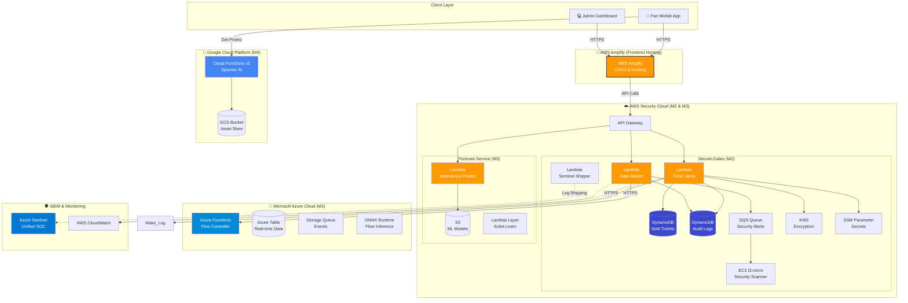

<div align="center">

# 🌍 CAN 2025 FanOps Platform

### 🏆 The Intelligent Multi-Cloud Platform for the Africa Cup of Nations 2025

[](https://reactjs.org/)
[](https://vitejs.dev/)
[](https://aws.amazon.com/)
[](https://azure.microsoft.com/)
[](https://cloud.google.com/)
[](https://aws.amazon.com/amplify/)

**[🚀 Live Demo](https://main.d37e6g35293289.amplifyapp.com/) • [📖 Documentation](docs/) • [🏗️ Architecture](#-enterprise-architecture) • [👥 Team](#-team)**

---

### 💡 **Revolutionizing the Stadium Experience**

A state-of-the-art **Multi-Cloud** ecosystem designed to manage 50,000+ fans in real-time. Combining **AWS Serverless Security**, **Azure AI Flow Control**, and **GCP Predictive Analytics** into a seamless experience.

</div>

---

## 🏗️ Enterprise Architecture

This project demonstrates a sophisticated **Hybrid Multi-Cloud Strategy**, leveraging the best-in-class services from AWS, Azure, and Google Cloud.



---

## 🧩 Microservices Breakdown

### 🎨 Frontend Application
- **Hosting**: **AWS Amplify** (Global CDN, CI/CD)
- **Framework**: React 18 + Vite
- **UI System**: Tailwind CSS + shadcn/ui + Framer Motion
- **State**: Zustand Store

### 🔐 M2: Secure-Gates Service (AWS)
*Secure, high-performance ticket validation system.*
- **Compute**: **AWS Lambda** (Node.js 20.x) - Serverless architecture.
- **Database**: **DynamoDB**
  - `SoldTicketsTable`: Validates ticket existence.
  - `UsedJtiTable`: Prevents replay attacks using JWT JTI.
  - `AuditTable`: Immutable log of all entry attempts.
- **Messaging**: **Amazon SQS** for decoupling security alerts.
- **Security**: 
  - **KMS (Key Management Service)** for encrypting sensitive data.
  - **SSM Parameter Store** for managing environment secrets securely.
- **Infrastructure**: **EC2 (t3.micro)** hosting ZAP scanners for continuous security auditing.
- **Logging**: **CloudWatch Logs** integrated with **Azure Sentinel** via a custom shipper.

### 🧠 M1: flow-controller (Azure)
*Intelligent crowd management core.*
- **Core**: **Azure Functions** (Python).
- **AI Engine**: **ONNX Runtime** running LightGBM models for queue prediction.
- **Storage**: Azure Table Storage for low-latency state management.

### 🔮 M3: Forecast Service (AWS)
*Predictive modeling for attendance.*
- **Compute**: **AWS Lambda** (Python 3.9).
- **ML Stack**: **Scikit-Learn** via Lambda Layers.
- **Storage**: **S3** for model versioning and artifact storage (`m3-forecast-models-can2025`).

### 📢 M4: Sponsor AI (GCP)
*Context-aware targeted advertising.*
- **Compute**: **Google Cloud Functions Gen 2** (Python 3.10).
- **Assets**: Google Cloud Storage.

---

## 🛠️ Technology Stack Summary

| Cloud Provider | Service | Usage |
|:---:|:---|:---|
|  | **Amplify** | Frontend Hosting & Deployment |
| | **Lambda** | Serverless Compute (Security & Forecasting) |
| | **DynamoDB** | NoSQL Database (High scale) |
| | **SQS** | Asynchronous Messaging |
| | **KMS / SSM** | Encryption & Secret Management |
| | **EC2** | Security Infrastructure |
|  | **Functions** | Event-Driven Compute |
| | **Table Storage** | Fast Key/Value Store |
| | **Sentinel** | SIEM / Security Monitoring |
|  | **Cloud Functions** | Sponsor Recommendation Engine |

---

## 🚀 Quick Start

### Prerequisites
- Node.js 18+
- AWS CLI configured
- Azure CLI configured
- Python 3.9+

### Installation

```bash
# 1. Clone the repository
git clone https://github.com/MouhcineAGOUJIL/FanOps-Frontend
cd FanOps

# 2. Install Root Dependencies (if applicable)
npm install

# 3. Frontend Setup
cd frontend
npm install
npm run dev
```

The application will start at `http://localhost:5173`. Make sure to configure your `.env` file with the correct API Gateway endpoints for M1, M2, M3, and M4.

---

## 👥 Team

Built with ❤️ by the **Cloud Computing S5 Team**.

| Member | Role | Focus Area |
|:---|:---|:---|
| **Mouhcine AGOUJIL** | Frontend Lead & Integration | UI/UX, AWS Amplify, State Management |
| **El Mehdi OUGHEGI** | M1 Architect (Azure) | Azure Functions, AI Model, Flow Logic |
| **Teammate 3** | M2 Security Lead (AWS) | AWS Lambda, DynamoDB, Cryptography |
| **Mohamed LAMZIOUAQ** | M4 Data Eng (GCP) | GCP Cloud Functions, Data pipelines |

---

<div align="center">

**[⬆ Back to Top](#-can-2025-fanops-platform)**

</div>
