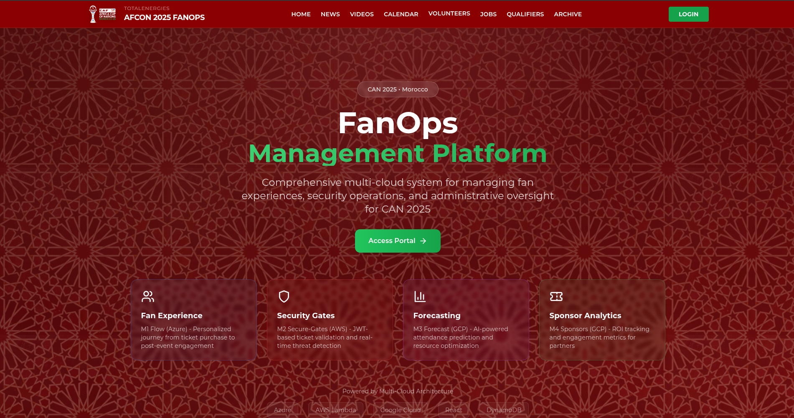
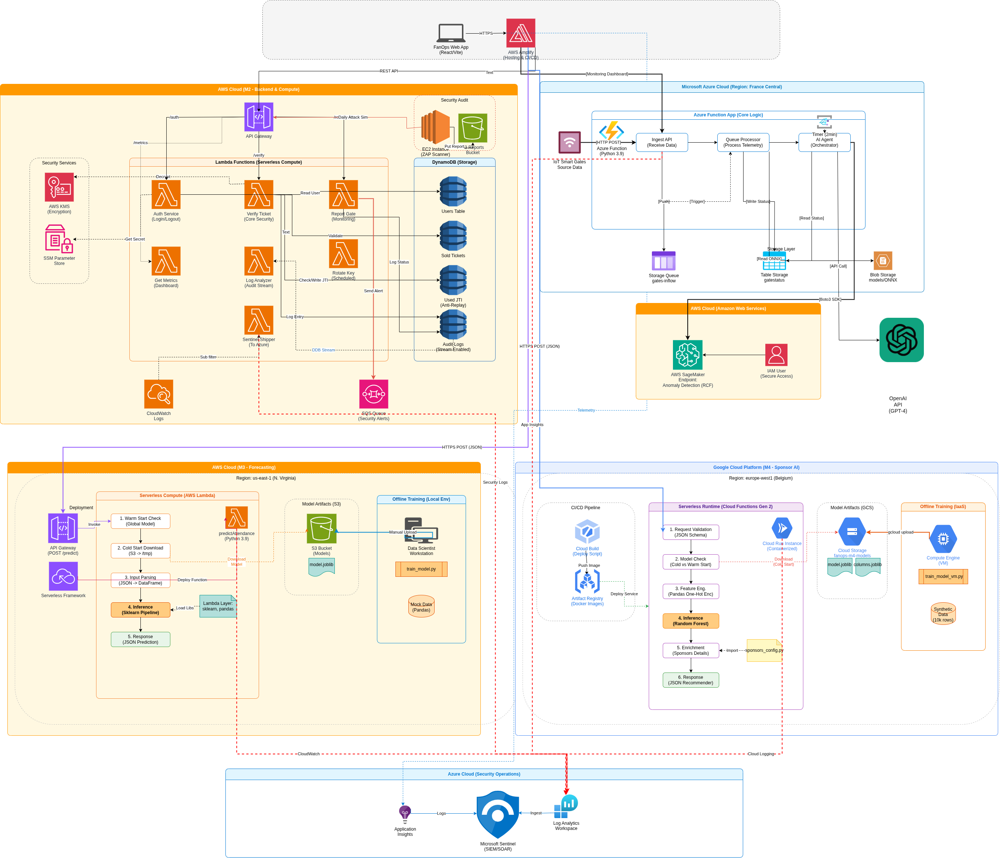

<div align="center">

# 🌍 CAN 2025 FanOps Platform

### 🏆 The Intelligent Multi-Cloud Ecosystem for the Africa Cup of Nations 2025

[](https://reactjs.org/)
[](https://vitejs.dev/)
[](https://aws.amazon.com/)
[](https://azure.microsoft.com/)
[](https://cloud.google.com/)
[](https://aws.amazon.com/amplify/)

**[🚀 Live Demo](https://main.d37e6g35293289.amplifyapp.com/) • [📖 Documentation](docs/) • [🏗️ Architecture](#-enterprise-architecture) • [👥 Team](#-team)**

---

### 💡 **Revolutionizing the Stadium Experience**

**FanOps** is a state-of-the-art **Multi-Cloud** platform designed to manage the safety, flow, and engagement of 50,000+ fans in real-time. By orchestrating **AWS Serverless Security**, **Azure AI Flow Control**, and **GCP Predictive Analytics**, we deliver a unified, latency-free stadium experience.

<br/>



</div>

---

## � Key Features

| Feature | Description | Service |
|:---|:---|:---:|
| **🎟️ Secure Entry** | Millisecond-latency ticket validation with anti-replay protection. | **AWS M2** |
| **🌊 Crowd Control** | Real-time inflow monitoring and gate latency prediction using AI. | **Azure M1** |
| **🔮 Smart Forecasting** | Attendance prediction models adapting to weather and team popularity. | **AWS M3** |
| **📢 Targeted Ads** | Context-aware sponsor recommendations delivered to fans. | **GCP M4** |
| **🛡️ Unified SOC** | Centralized security oversight detecting threats across all clouds. | **Azure Sentinel** |

---

## 🏗️ Enterprise Architecture

Our architecture implements a **Best-of-Breed** multi-cloud strategy, avoiding vendor lock-in by utilizing the strongest capabilities of each provider.

<div align="center">
  
</div>

### � Data Flow Overview
1.  **User Interaction**: Fans use the React Web App (AWS Amplify) to buy tickets and view match info.
2.  **Validation (AWS)**: At the gate, tickets are validated against DynamoDB.
3.  **Flow Analysis (Azure)**: Entry events are streamed to Azure to calculate real-time queue wait times.
4.  **Intelligence (GCP)**: The app fetches personalized sponsor deals from Google Cloud based on user location/profile.
5.  **Monitoring**: All system logs are shipped to Azure Sentinel for anomaly detection.

---

## 🧩 Microservices Deep Dive

### 🎨 Frontend Application (The Hub)
*   **Tech Stack**: React 18, Vite, Tailwind CSS, Shadcn UI, Framer Motion.
*   **Performance**: Sub-second load times via AWS Amplify's global edge network.
*   **Visualization**: Real-time charts (Recharts) for gate status and attendance metrics.

### 🔐 M2: Secure-Gates Service Service (AWS)
*The security backbone ensuring 100% valid entries.*
-   **Compute**: **AWS Lambda** (Node.js 20.x) for stateless, infinite scaling.
-   **Data Integrity**:
    -   **DynamoDB** with On-Demand Capacity for handling surge traffic (game start).
    -   **Strong Consistency** reads for ticket validation to prevent double-entry.
-   **Security**:
    -   **KMS**: Envelope encryption for all sensitive ticket data.
    -   **ZAP Scanner**: An automated EC2 instance running OWASP ZAP to pen-test endpoints daily.

### 🧠 M1: Operational Intelligence (Azure)
*The brain optimizing crowd safety.*
-   **Event Logic**: **Azure Functions** (Python) triggered by HTTP streams from gates.
-   **AI Inference**: Uses **ONNX Runtime** to execute LightGBM models trained on historical crowd data.
-   **State Management**: **Azure Table Storage** provides sub-10ms access to gate status (Green/Yellow/Red) for the dashboard.

### 🔮 M3: Forecast Service (AWS)
*Predicting the future to optimize resource allocation.*
-   **Optimization**: **Python 3.9 Lambda** with custom Layers (Scikit-learn, Pandas) tuned for fast cold-starts.
-   **Workflow**:
    1.  Fetches match metadata (Team A vs Team B, Temperature).
    2.  Loads pre-trained model artifacts from **S3**.
    3.  Returns predicted attendance confidence intervals.

### 📢 M4: Sponsor AI (GCP)
*Delivering value to partners and fans.*
-   **Engine**: **Google Cloud Functions Gen 2** (Python 3.10).
-   **Logic**: Analyzes user session context to serve highly relevant sponsor assets stored in **Cloud Storage**.

---

## � Security & Compliance Strategy

Security is not an afterthought; it is baked into every layer ("Shift Left").

*   **Encryption in Transit**: All cross-cloud traffic is TLS 1.3 encrypted.
*   **Access Control**: Least Privilege Principle enforced via IAM Roles (AWS) and Managed Identities (Azure).
*   **Audit Trail**: Every ticket scan creates an immutable audit log entry in DynamoDB Streams.
*   **SIEM Integration**: A custom "Sentinel Shipper" Lambda forwards critical high-severity alerts from AWS CloudWatch directly to **Microsoft Azure Sentinel** for SOC analysis.

---

## 🚀 Quick Start

### Prerequisites
-   **Node.js**: v20+
-   **Python**: v3.9+
-   **Cloud CLIs**: AWS, Azure, Google Cloud SDK installed and configured.

### Environment Setup

1.  **Clone the repository**
    ```bash
    git clone https://github.com/MouhcineAGOUJIL/FanOps-Frontend
    cd FanOps
    ```

2.  **Frontend Configuration**
    Create a `.env` file in `/frontend`:
    ```env
    VITE_API_URL_M1_AZURE=https://fanops-flow.azurewebsites.net/api
    VITE_API_URL_M2_AWS=https://api.fanops.aws/prod
    VITE_API_URL_M3_AWS=https://api.forecast.aws/v1
    VITE_API_URL_M4_GCP=https://europe-west1-fanops-sponsor.cloudfunctions.net
    ```

3.  **Install & Run**
    ```bash
    npm install
    cd frontend
    npm install
    npm run dev
    ```

---

## 👥 Team

Built with ❤️ by the **Cloud Computing 2.0 Team**.

| Member | Role | Focus Area |
|:---|:---|:---|
| [**Mouhcine AGOUJIL**](https://github.com/MouhcineAGOUJIL) | M2 Security Lead (AWS) | AWS Lambda, DynamoDB, Cryptography |
| [**El Mehdi OUGHEGI**](https://github.com/comehdi) | M1 Architect (Azure) | Azure Functions, AI Model, Flow Logic |
| [**Omar TADLAOUI**](https://github.com/omar629753) | M3 Forecast Lead (AWS) | Scikit-Learn, Lambda, S3, Predictions |
| [**Mohamed LAMZIOUAQ**](https://github.com/medlamziouaq) | M4 Data Eng (GCP) | GCP Cloud Functions, Sponsor Pipelines |
---

<div align="center">

**[⬆ Back to Top](#-can-2025-fanops-platform)**

</div>
