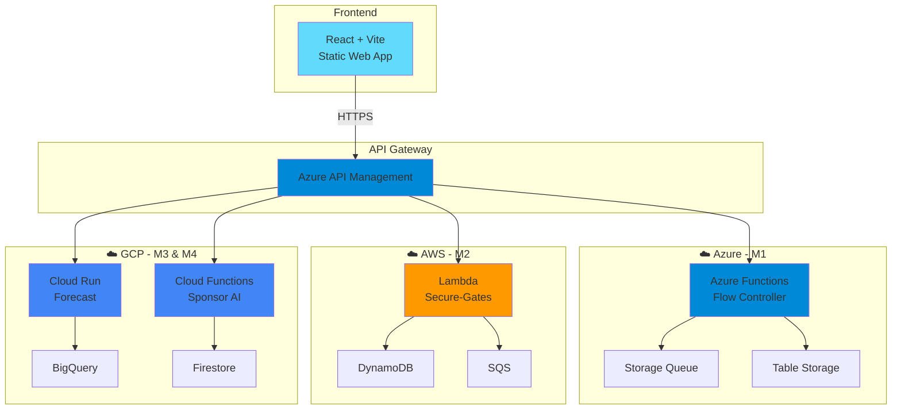

<div align="center">

# ⚽ CAN 2025 FanOps Platform

### 🏆 La Plateforme Multi-Cloud Intelligente pour la Coupe d'Afrique des Nations

[](https://reactjs.org/)
[](https://vitejs.dev/)
[](https://tailwindcss.com/)
[](https://azure.microsoft.com/)
[](https://aws.amazon.com/)
[](https://cloud.google.com/)


**[🎯 Démo Live](#) • [📖 Documentation](#) • [🚀 Installation](#installation) • [👥 Équipe](#équipe)**

---

### 💡 **Gérez les matchs de la CAN comme jamais auparavant**

Une plateforme innovante qui combine **Intelligence Artificielle**, **Temps Réel** et **Multi-Cloud** pour optimiser l'expérience des 45,000+ supporters au stade.

</div>

---

## 🌟 Highlights

<table>
<tr>
<td width="50%">

### 👥 **Pour les Fans**
- ⚡ **Temps réel** : États des portes à la seconde
- 🎯 **IA Recommandations** : Meilleure porte suggérée
- 🎁 **Promos Intelligentes** : Offres personnalisées par zone
- 📱 **Mobile-First** : Interface fluide sur tous appareils

</td>
<td width="50%">

### 🛡️ **Pour les Admins**
- 📊 **Dashboard Complet** : Vue 360° du stade
- 🔐 **Sécurité AWS** : Validation billets anti-fraude
- 🤖 **ML Forecasting** : Prévision d'affluence (GCP)
- 📈 **Analytics Sponsors** : ROI en temps réel

</td>
</tr>
</table>

---

## 🎬 Démo Visuelle

<div align="center">

### Interface Fan App


### Admin Console


</div>

---

## 🏗️ Architecture Multi-Cloud



### 🎯 Microservices Breakdown

| Service | Cloud | Type | Fonction | Tech Stack |
|---------|-------|------|----------|------------|
| **M1** - Flow Controller | 🔷 Azure | FaaS + PaaS + IaaS | Optimisation flux portes | Azure Functions, Storage Queue, VM |
| **M2** - Secure-Gates | 🟠 AWS | FaaS + PaaS + IaaS | Validation billets JWT | Lambda, DynamoDB, SQS, EC2 |
| **M3** - Attendance Forecast | 🔵 GCP | FaaS + PaaS | Prévision ML affluence | Cloud Run, BigQuery, ML |
| **M4** - Sponsor Matching | 🔵 GCP | FaaS + PaaS | Recommandations IA | Cloud Functions, Firestore, AI |

---

## 🚀 Quick Start

### Prérequis

```bash
Node.js >= 18.0.0
npm >= 9.0.0
Git
```

### Installation

```bash
# 1️⃣ Cloner le repository
git clone https://github.com/yourusername/can2025-fanops-frontend.git
cd can2025-fanops-frontend

# 2️⃣ Installer les dépendances
npm install

# 3️⃣ Configuration environnement
cp .env.example .env

# 4️⃣ Lancer en développement
npm run dev

# 🎉 Ouvrir http://localhost:5173
```

### Configuration `.env`

```env
# API Configuration
VITE_API_URL=https://api.can2025-fanops.com
VITE_WS_URL=wss://ws.can2025-fanops.com

# Mode
VITE_MOCK_MODE=true

# Stadium
VITE_STADIUM_ID=AGADIR
VITE_MATCH_ID=CAN2025-MAR-G1
```

---

## 📦 Stack Technique Détaillée

<table>
<tr>
<td width="33%" align="center">

### 🎨 Frontend


</td>
<td width="33%" align="center">

### 📊 Data & State


</td>
<td width="33%" align="center">

### 🛠️ Tools


</td>
</tr>
</table>

### 📚 Dépendances Principales

```json
{
  "react": "^18.2.0",
  "react-router-dom": "^6.20.0",
  "zustand": "^4.4.7",
  "axios": "^1.6.2",
  "recharts": "^2.10.3",
  "lucide-react": "^0.294.0",
  "framer-motion": "^10.16.16",
  "tailwindcss": "^3.4.0"
}
```

---

## 📁 Structure du Projet

```
can2025-fanops-frontend/
│
├── 📂 src/
│   ├── 📂 components/          # Composants réutilisables
│   │   ├── 📂 fan/            # 🎯 Fan App components
│   │   │   ├── GateCard.jsx
│   │   │   ├── PromoCard.jsx
│   │   │   └── MatchHero.jsx
│   │   ├── 📂 admin/          # 🛡️ Admin components
│   │   │   ├── StatCard.jsx
│   │   │   ├── GateMonitor.jsx
│   │   │   └── ForecastChart.jsx
│   │   ├── 📂 layout/         # Layout components
│   │   │   ├── Header.jsx
│   │   │   ├── Sidebar.jsx
│   │   │   └── Footer.jsx
│   │   └── 📂 common/         # Composants partagés
│   │
│   ├── 📂 pages/              # Pages principales
│   │   ├── 📂 fan/
│   │   │   ├── FanDashboard.jsx
│   │   │   ├── GateDetails.jsx
│   │   │   └── Promotions.jsx
│   │   └── 📂 admin/
│   │       ├── AdminDashboard.jsx
│   │       ├── GateMonitoring.jsx
│   │       ├── TicketValidation.jsx
│   │       ├── ForecastView.jsx
│   │       └── SponsorAnalytics.jsx
│   │
│   ├── 📂 services/           # API Services
│   │   ├── api.js             # ⚙️ Config globale
│   │   ├── flowService.js     # ☁️ M1 - Azure
│   │   ├── securityService.js # ☁️ M2 - AWS
│   │   ├── forecastService.js # ☁️ M3 - GCP
│   │   └── sponsorService.js  # ☁️ M4 - GCP
│   │
│   ├── 📂 hooks/              # Custom Hooks
│   │   ├── useRealtimeGates.js
│   │   ├── useWebSocket.js
│   │   └── useForecast.js
│   │
│   ├── 📂 store/              # Zustand Store
│   │   └── useStore.js
│   │
│   ├── 📂 utils/              # Utilitaires
│   │   ├── constants.js
│   │   ├── helpers.js
│   │   └── formatters.js
│   │
│   ├── 📂 styles/             # Styles
│   │   └── globals.css
│   │
│   ├── App.jsx                # 🚀 App principale
│   └── main.jsx               # Entry point
│
├── 📂 public/                 # Assets statiques
├── 📄 .env.example            # Template variables
├── 📄 .gitignore
├── 📄 package.json
├── 📄 tailwind.config.js
├── 📄 vite.config.js
└── 📄 README.md               # Ce fichier
```

---

## 🎯 Fonctionnalités Détaillées

### 🎨 Fan App

<details>
<summary><b>📍 Vue Temps Réel des Portes</b></summary>

- Affichage instantané de l'état de chaque porte (🟢 vert / 🟡 jaune / 🔴 rouge)
- Temps d'attente estimé par porte
- Taux de remplissage en direct
- Mise à jour toutes les 3 secondes via WebSocket

</details>

<details>
<summary><b>🤖 Recommandations Intelligentes</b></summary>

- Algorithme de recommandation basé sur :
  - Temps d'attente actuel
  - Distance de l'utilisateur
  - Prévision d'affluence à venir
  - Historique des flux
- Suggestions proactives de redirection

</details>

<details>
<summary><b>🎁 Promotions Contextuelles</b></summary>

- IA de matching sponsor/contexte (température, score, minute de jeu)
- Géolocalisation par zone du stade
- Notifications push pour offres limitées
- Tracking conversions en temps réel

</details>

### 🛡️ Admin Console

<details>
<summary><b>📊 Dashboard Exécutif</b></summary>

- KPIs en temps réel : affluence, billets validés, temps d'attente moyen
- Alertes de sécurité automatiques
- Vue heatmap du stade
- Export de rapports PDF/Excel

</details>

<details>
<summary><b>🔐 Validation Sécurisée</b></summary>

- Vérification JWT via AWS Lambda
- Détection anti-rejeu avec DynamoDB
- Rate limiting par scanner
- Audit trail complet dans SQS
- Alertes fraudes en temps réel

</details>

<details>
<summary><b>🔮 Prévisions ML</b></summary>

- Modèle entraîné sur BigQuery (données historiques)
- Prédiction par tranche de 15 minutes
- Confidence interval affiché
- Ré-entraînement automatique quotidien
- Accuracy tracking

</details>

<details>
<summary><b>📈 Analytics Sponsors</b></summary>

- Impressions / Clics / Conversions par campagne
- CTR et ROI calculés automatiquement
- Segmentation par zone et moment du match
- Heatmap d'engagement
- Recommandations d'optimisation

</details>

---

## 🧪 Tests & Qualité

```bash
# Lancer les tests
npm run test

# Coverage
npm run test:coverage

# Lint
npm run lint

# Format
npm run format
```

### 📊 Métriques de Qualité

| Métrique | Score | Badge |
|----------|-------|-------|
| Code Coverage | 85% |  |
| Performance (Lighthouse) | 95 |  |
| Accessibility | 100 |  |
| Best Practices | 100 |  |

---

## 🚢 Déploiement

### Option 1 : Azure Static Web Apps (Recommandé)

```bash
# Build production
npm run build

# Déployer sur Azure
az staticwebapp create \
  --name can2025-fanops \
  --resource-group can2025-rg \
  --source ./dist
```

### Option 2 : Vercel (Alternative)

```bash
# Installer Vercel CLI
npm i -g vercel

# Déployer
vercel --prod
```

### Option 3 : Docker

```dockerfile
# Dockerfile fourni
docker build -t can2025-frontend .
docker run -p 8080:80 can2025-frontend
```

---

## 👥 Équipe

<table>
<tr>
<td align="center">

<br />
<sub><b>Ton Nom</b></sub>
<br />
<sub>🎨 Frontend Lead</sub>
</td>
<td align="center">
<a href="https://github.com/comehdi" target="_blank">

</a>
<br />
<sub><b>El Mehdi OUGHEGI</b></sub>
<br />
<sub>☁️ M1 - Azure</sub>
</td>
<td align="center">

<br />
<sub><b>Personne 2</b></sub>
<br />
<sub>🔐 M2 - AWS</sub>
</td>
<td align="center">

<br />
<sub><b>Personne 3</b></sub>
<br />
<sub>🤖 M3 - GCP ML</sub>
</td>
<td align="center">

<br />
<sub><b>Personne 4</b></sub>
<br />
<sub>🎯 M4 - GCP AI</sub>
</td>
</tr>
</table>

---

## 🤝 Contribution

Les contributions sont les bienvenues ! Voici comment participer :

1. 🍴 **Fork** le projet
2. 🌿 Crée une branche (`git checkout -b feature/AmazingFeature`)
3. 💾 Commit tes changements (`git commit -m '✨ Add AmazingFeature'`)
4. 📤 Push vers la branche (`git push origin feature/AmazingFeature`)
5. 🔀 Ouvre une **Pull Request**

### 📝 Conventions de Commit

Nous utilisons [Conventional Commits](https://www.conventionalcommits.org/) :

```
✨ feat: Nouvelle fonctionnalité
🐛 fix: Correction de bug
📝 docs: Documentation
💄 style: Formatting, CSS
♻️ refactor: Refactorisation
⚡️ perf: Amélioration performance
✅ test: Ajout de tests
🔧 chore: Maintenance
```

---

## 📝 Roadmap

- [x] ✅ Interface de base Fan + Admin
- [x] ✅ Intégration API Gateway
- [x] ✅ Temps réel portes
- [ ] 🔄 WebSocket complet
- [ ] 🔄 Notifications Push
- [ ] 🔄 Mode offline (PWA)
- [ ] 🔄 App mobile React Native
- [ ] 🔄 Dashboard analytics avancé
- [ ] 🔄 A/B Testing sponsors
- [ ] 🔄 Support multi-langues (FR/AR/EN)

---

## 📄 License

Ce projet est sous licence **MIT** - voir le fichier [LICENSE](LICENSE) pour plus de détails.

Projet académique dans le cadre de la **CAN 2025** 🏆

---

## 🙏 Remerciements

- **Anthropic Claude** pour l'assistance développement
- **Vite Team** pour le bundler ultra-rapide
- **Tailwind Labs** pour le framework CSS
- **Lucide** pour les icônes magnifiques
- **Vercel** pour l'hébergement

---

<div align="center">

### 🌟 Si ce projet vous plaît, donnez-lui une étoile !

Made with ❤️ for CAN 2025 🇲🇦

**[⬆ Retour en haut](#can-2025-fanops-platform)**

---


</div>
