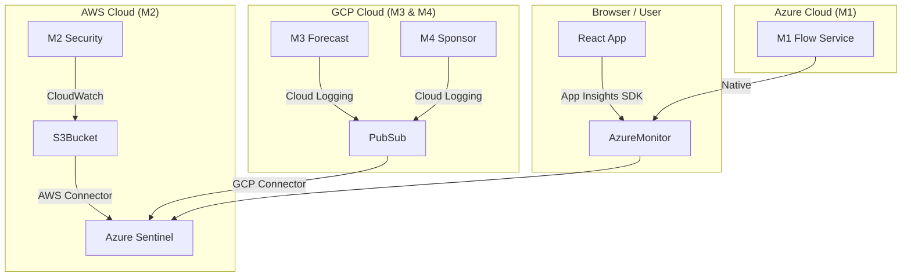

# 🛡️ FanOps Unified SIEM: Azure Sentinel Configuration

## 🎯 Objective
Configure **Azure Sentinel** to ingest logs and detect threats across **AWS (M2)**, **Azure (M1)**, **GCP (M3/M4)**, and **Frontend**.

---

## 🏗️ Architecture



---

## 🛠️ Phase 1: The Core (Azure)

### 1. Create Log Analytics Workspace
*This is the "Brain" where all logs are stored.*

1.  **Azure Portal** > Search **"Log Analytics workspaces"**.
2.  **Create New**:
    *   Name: `fanops-sentinel-core`
    *   Region: `West Europe`
3.  **Enable Sentinel**:
    *   Search **"Microsoft Sentinel"**.
    *   Click **Create** > Select `fanops-sentinel-core`.

---

## 💻 Phase 2: Frontend (React)

*Capture user-side errors and performance.*

### 1. Create Application Insights
1.  **Azure Portal** > Search **"Application Insights"**.
2.  **Create New**:
    *   Name: `fanops-frontend-insights`
    *   Workspace: `fanops-sentinel-core` (Link it here!)
3.  **Get Connection String**: Copy it from the Overview blade.

### 2. Install SDK in Frontend
Run this in your `frontend` folder:
```bash
npm install @microsoft/applicationinsights-web
```

### 3. Initialize in Code
Create `frontend/src/services/telemetry.js`:
```javascript
import { ApplicationInsights } from '@microsoft/applicationinsights-web';

const appInsights = new ApplicationInsights({ config: {
  connectionString: 'YOUR_CONNECTION_STRING_HERE',
  enableAutoRouteTracking: true
} });

appInsights.loadAppInsights();
export default appInsights;
```
*Import this in `main.jsx` to start tracking.*

---

## ☁️ Phase 3: M1 (Azure Functions)

*Since M1 is already in Azure, this is native.*

1.  Go to your **Function App (M1)** in Azure Portal.
2.  Blade: **Diagnostic settings** (under Monitoring).
3.  **Add diagnostic setting**:
    *   Name: `send-to-sentinel`
    *   Check: `FunctionAppLogs`
    *   Destination: **Send to Log Analytics workspace** > `fanops-sentinel-core`.

---

## 🔶 Phase 4: M2 (AWS Lambda)

*Connect AWS CloudTrail (Management) and CloudWatch (Logs).*

### 1. AWS Side
1.  **Create User**: IAM User `AzureSentinelUser` with `Programmatic Access`.
2.  **Permissions**: Attach `AWSCloudTrailReadOnlyAccess`.
3.  **Save Keys**: Keep Access Key ID & Secret.

### 2. Azure Sentinel Side
1.  **Content Hub** > Search **"Amazon Web Services"**.
2.  **Install** > **Add Data Connector**.
3.  **Configuration**:
    *   Enter the AWS Access Key & Secret.
    *   Select Region: `eu-west-1`.
    *   Click **Connect**.

---

## 🔷 Phase 5: M3 & M4 (GCP)

*Use the GCP Pub/Sub connector.*

### 1. GCP Side
1.  **Create Pub/Sub Topic**: `export-logs-to-azure`.
2.  **Log Router**:
    *   Go to **Logging** > **Logs Router**.
    *   Create Sink: `sentinel-sink`.
    *   Destination: Pub/Sub Topic created above.
3.  **Service Account**: Create one with `Pub/Sub Subscriber` role. Save JSON key.

### 2. Azure Sentinel Side
1.  **Content Hub** > Search **"Google Cloud Platform"**.
2.  **Install** > **Add Data Connector** (GCP Pub/Sub Audit Logs).
3.  **Configuration**:
    *   Upload the GCP Service Account JSON.
    *   Enter Project ID and Subscription Name.

---

## 🔍 Phase 6: Threat Detection (KQL Rules)

*Copy these queries into Sentinel > Analytics > Create Scheduled Query.*

### 1. Detect Cross-Cloud Brute Force (AWS & Azure)
*Finds IPs failing login in AWS and M1 simultaneously.*
```kusto
let aws_fails = AWSCloudTrail
| where EventName == "ConsoleLogin" and ResponseElements has "Failure"
| project IP=SourceIpAddress, Time=TimeGenerated, Cloud="AWS";
let azure_fails = SigninLogs
| where ResultType != 0
| project IP=IPAddress, Time=TimeGenerated, Cloud="Azure";
aws_fails
| join kind=inner azure_fails on IP
| project IP, AWS_Time=Time, Azure_Time=Time1
```

### 2. Detect Frontend Attacks (XSS/Injection)
*From App Insights data.*
```kusto
AppRequests
| where Name contains "security"
| where ResultCode startswith "4" or ResultCode startswith "5"
| summarize Count=count() by ClientIP
| where Count > 50
```

### 3. M2 Ticket Scan Anomalies
```kusto
AWSCloudWatchLogs
| where Message has "verifyTicket"
| parse Message with * "result" * ":" * Result * ","
| where Result == "replay_attack"
| summarize count() by bin(TimeGenerated, 1h)
| where count_ > 10
```
